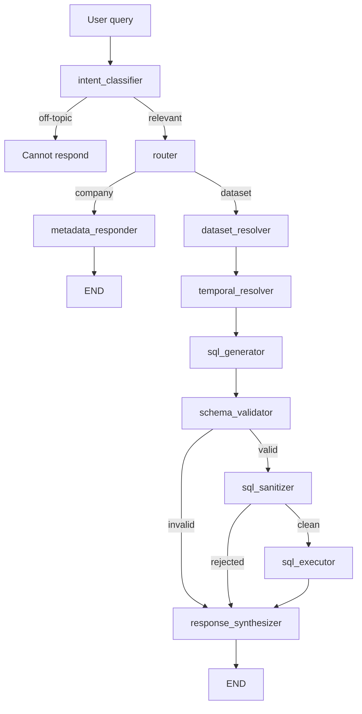

# grocery-langgraph-agent

Beginner-friendly LangGraph project that answers company and dataset questions over branch snapshot CSV files.

It uses a multi-node agent flow:
1. Classify relevance
2. Route company vs dataset questions
3. Resolve datasets and time snapshot
4. Generate safe read-only SQL
5. Execute in DuckDB
6. Synthesize final answer

## Why this project

1. Shows practical agent design, not just a single prompt call.
2. Demonstrates controlled SQL generation with validation and sanitization.
3. Uses snapshot-based data modeling, which mirrors real analytics pipelines.
4. Separates company-context responses from data-query responses.
5. Includes sensitive-value tokenization and in-memory restoration flow.

This makes it a strong learning project for prompt engineering, workflow orchestration, and safe data access patterns.

## What this project demonstrates

1. Branch-based snapshot data model: branch/resource/timestamped CSV files
2. Schema registry generation with sensitive-column metadata
3. Tokenized sensitive values via lookup JSON
4. Prompt-routed LangGraph pipeline with guardrails
5. SQL validation and sanitizer before execution
6. In-memory detokenization before analytics and response output

## Architecture



## Project structure

1. main.py: CLI entry point (one-shot and interactive modes)
2. agent.py: LangGraph nodes, routing, SQL generation, execution
3. generate_data.py: sample data + schema_registry.json generator
4. hasher.py: tokenization lookup helpers and detokenization
5. pyproject.toml: project metadata and dependencies

## Prerequisites

1. Python 3.11+
2. uv package manager
3. Ollama installed locally
4. Ollama model pulled, for example:

```bash
ollama pull qwen2.5
```

## Quick start

1. Install dependencies:

```bash
uv sync
```

2. Generate sample data and schema registry:

```bash
uv run generate_data.py
```

3. Run in interactive mode:

```bash
uv run main.py
```

4. Run one question directly:

```bash
uv run main.py "How do almond milk prices compare between branch_a and branch_b?"
```

5. Run verbose mode (shows SQL + snapshot info):

```bash
uv run main.py --verbose "What were the total sales in branch_a in January 2025?"
```

## Example questions

1. What are your latest announcements?
2. What is FreshMart's contact email?
3. Compare the price of whole milk across all three branches.
4. Which branch has the highest total inventory for dairy products?
5. Show me the top 3 best-selling products in branch_b by quantity.
6. What products are out of stock in branch_c?

## Sample terminal outputs

Dataset query:

```text
$ uv run main.py --verbose "Compare the price of whole milk across all three branches"

Q: Compare the price of whole milk across all three branches

[debug] sql_query      : SELECT branch, product_name, price
FROM (
	SELECT 'branch_a' AS branch, p.product_name, p.price
		FROM branch_a_products p
		WHERE p.product_name ILIKE '%whole milk%'
	UNION ALL
	SELECT 'branch_b', p.product_name, p.price
		FROM branch_b_products p
		WHERE p.product_name ILIKE '%whole milk%'
	UNION ALL
	SELECT 'branch_c', p.product_name, p.price
		FROM branch_c_products p
		WHERE p.product_name ILIKE '%whole milk%'
) t
[debug] sql_is_valid   : True
[debug] target_snapshot: None
[debug] error          : None

A: Branch A: $3.04, Branch B: $3.88, Branch C: $3.48.
```

Off-topic rejection:

```text
$ uv run main.py --verbose "How do you fix a bug in Python?"

Q: How do you fix a bug in Python?

[debug] sql_query      :
[debug] sql_is_valid   : False
[debug] target_snapshot: None
[debug] error          : None

A: I can only answer questions about FreshMart Co. and its data.
```

## Data model summary

Generated layout:

```text
data/
	branch_a/
		products/products_YYYY-MM-DD.csv
		sales/sales_YYYY-MM-DD.csv
		inventory/inventory_YYYY-MM-DD.csv
	branch_b/
	branch_c/
schema_registry.json
hash_lookup.json
```

Sensitive values are tokenized at rest and restored in memory for query execution/response formatting.

## Safety guardrails

1. Intent gate for off-topic rejection
2. Table/schema validation before SQL execution
3. SQL sanitizer rejects non-read-only patterns
4. One-statement SQL policy
5. Limited schema injection for prompt context

## Notes

1. This project is intentionally simple and prompt-driven for learning.
2. Results depend on local model quality and prompt compliance.
3. For production use, add stronger SQL AST checks, auth, and observability.

## License

Add your preferred license.